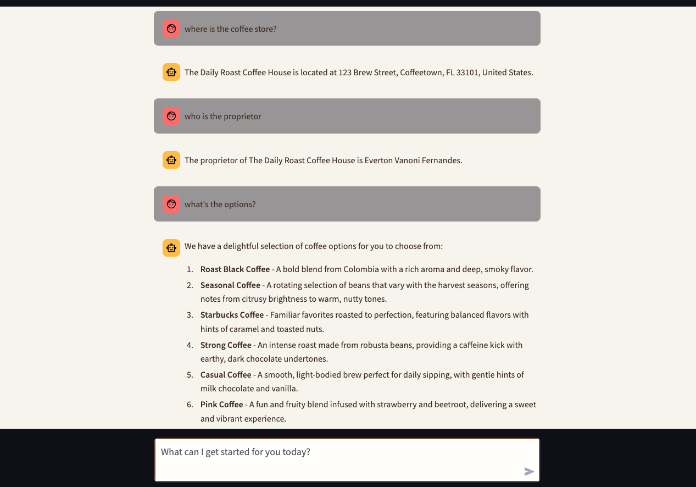

# ☕ AI Coffee Chatbot

This is a Streamlit-based chatbot application that simulates a virtual coffee seller. The app uses a large language model to help users choose from a set of predefined coffee options.

## Demo

- [YouTube Demo](https://youtu.be/P6QKb9Bdk-k?si=DxDi1Aa3K_u8SfjW)



## Installation

1. Clone the repository:
   ```bash
   git clone https://github.com/vertocode/ai-coffee-chatbot
   cd ai-coffee-chatbot
   ```

2. (Optional, but recommended) Create and activate a Python virtual environment:
   ```bash
   python -m venv venv
   source venv/bin/activate  # On Windows use `venv\Scripts\activate`
   ```

3. Install dependencies:
   ```bash
   pip install -r requirements.txt
   ```

4. Set your OpenAI API key in a `.env` file:
   ```
   OPENAI_API_KEY=your_openai_key_here
   ```

## Running the App

```bash
streamlit run src/app.py
```

The app will open in your browser. Just type your coffee preference and the assistant will suggest a drink!

## Customization

You can customize the coffee types, tone, or assistant personality by modifying the system prompt in `agent.py`.

## License

MIT License. Feel free to modify and use this project for your own virtual store experiments!